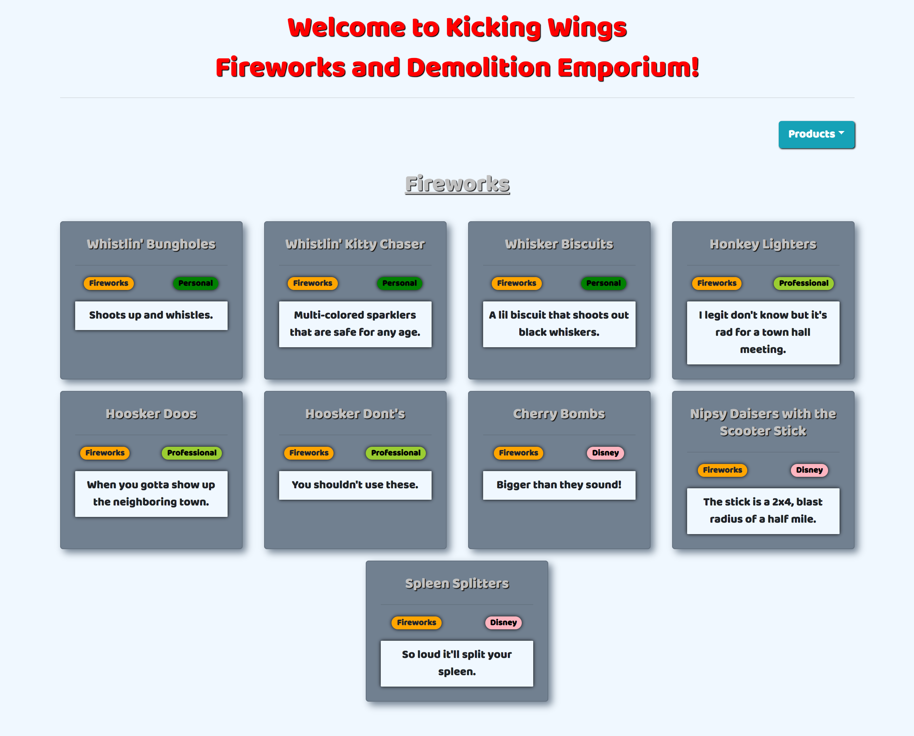
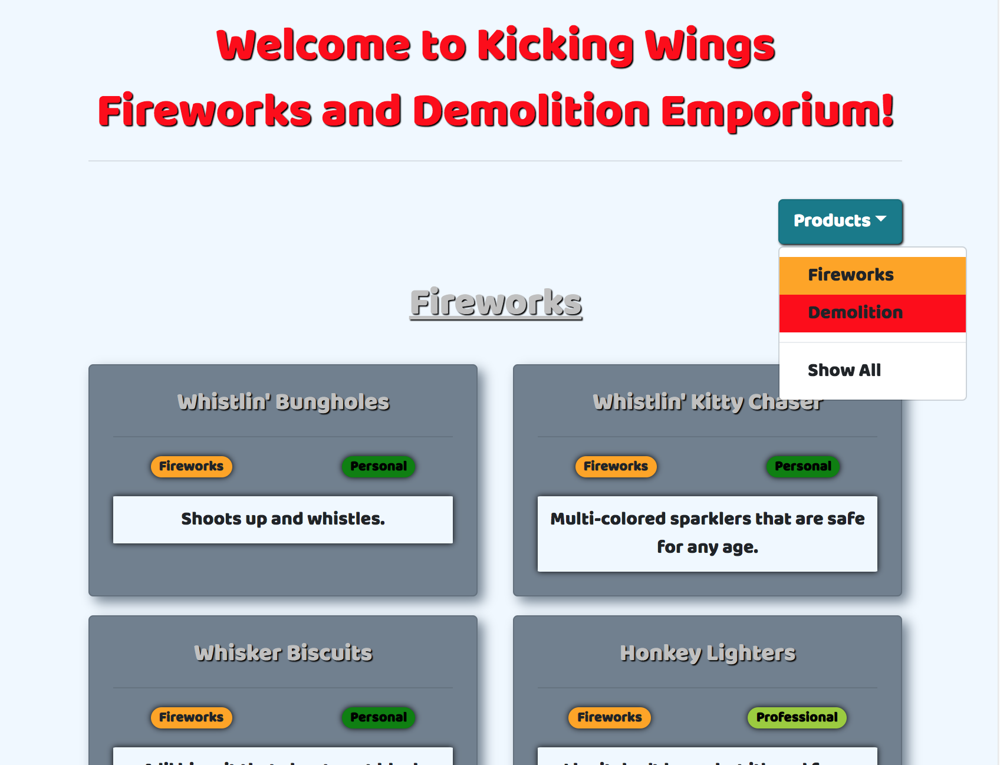

# Acme

## Description 
A simple website for a fireworks/demolition store. You select which category you want and a list of cards will populate with those products in that category. 

## Screenshots
#### Page Load

#### Show All

#### Show One

#### Tablet

#### Mobile

## Installation Instructions
* Clone down this repo
* At the root of the project, run `npm install`

## How to run
* In the terminal, type `npm start` to run the webpage.
* If you want to make a production build of this project, type `npm run build`. This will create a folder called build with all of the minified code you need.

## Author
Greg Stephen